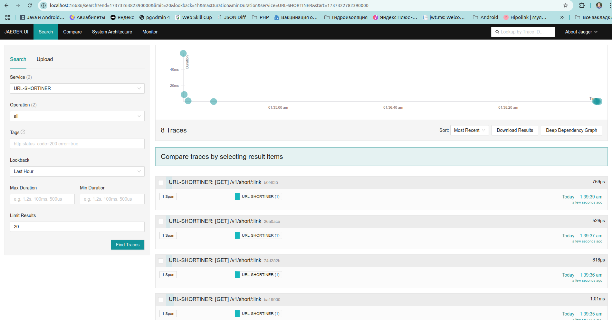

# Проект [go_shortiner](https://github.com/akozadaev/go_shortiner) 
предназначен для демонстрации некоторых возможностей языка Go

## Показывает работу с БД и ORM

PostgreSQL + GORM, подумать над миграциями (авто)
## Показывает работу с фреймворками, зависимостями

Gin Web Framework, Fx

##  Журналирование, ротация логов, трассировка

Zap, Jaeger

## Показывает работу с паттерном проектирования  Medaitor

Метод с общим названием Generate
