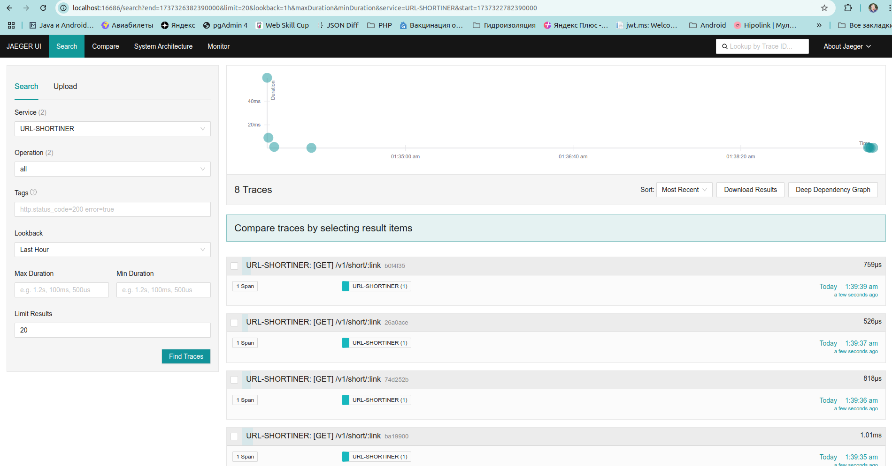

# Проект [go_shortiner](https://github.com/akozadaev/go_shortiner)

предназначен для демонстрации некоторых возможностей языка Go.
Здесь показана многопоточность (concurrency) языка Go, работа с некоторыми паттернами, БД, миграциями, логгированием (
журналированием).

Проект не рассчитан на практическое применение, а только показывает некоторые мои навыки. Запись в предрасчетную таблицу
ведется без учета уникальности (цель максимально быстро заполнить данными для генерации отчета).


## 1. Показывает работу с БД и ORM

PostgreSQL + GORM с автомиграциями

## 2. Показывает работу с миграциями

Goose

## 3. Показывает работу с фреймворками, зависимостями

Gin Web Framework, Fx

## Журналирование, ротация логов, трассировка

Zap, Jaeger


## Показывает работу с паттерном проектирования  Medaitor

Метод с общим названием Generate

## Для запуска

Скачать проект из репозитория, создать пустую базу Postgres с именем ```short```, gjkmpjdfntktv ```short``` выполнить в
консоли ```make build```, запустить собранное приложение.
Если хотите использовать другую имя БД и пароль, поменяйте их в файле
конфигурации [config.local.yaml](config%2Fconfig.local.yaml)

Или в контейнере: `sudo usermod -aG docker $USER
### Роуты:

1. [POST] /v1/short
   Отправить один или несколько URL на укорачивание

с телом объект или массив объектов вида:

```JSON
[
  {
    "url": "http://longlonglonglonglonglonglonglongurl.url"
  },
  {
    "url": "http://longlonglonglonglonglonglonglonglonglonglonglonglongurl.url"
  }
]
```

или

```JSON
{
  "url": "http://longlonglonglonglonglonglonglonglonglonglonglonglongurl.url"
}
```

2. [GET] /v1/short/:shortened
   Получить полную информацию об объекте по короткой ссылке

ответ вида:

```JSON
{
  "ID": 4,
  "CreatedAt": "2025-01-20T00:34:48.852775+03:00",
  "UpdatedAt": "2025-01-20T00:34:48.852775+03:00",
  "DeletedAt": null,
  "source": "http://urlEEEEEEEEee.url",
  "shortened": "https://short.ru/4339487037079594733"
}
```

3. [GET] /v1/users?per_page=0&offset=10
   Получить информацию о пользователях, зарегистрированных в системе

ответ вида:

```JSON
[
  {
    "ID": 1,
    "CreatedAt": "2025-04-19T18:50:40.337637+03:00",
    "UpdatedAt": "2025-04-19T18:50:40.337637+03:00",
    "DeletedAt": null,
    "name": "Алексей",
    "lastname": "Козадаев",
    "middlename": "Сергеевич",
    "email": "akozadaev@inbox.ru"
  }
]
```

или, если запросить без авторизации:

```JSON
{
  "errors": {
    "basic_token": "header_not_found"
  }
}
```

4. /v1/user/1

ответ вида:

```JSON
{
  "ID": 1,
  "CreatedAt": "2025-04-19T18:50:40.337637+03:00",
  "UpdatedAt": "2025-04-19T18:50:40.337637+03:00",
  "DeletedAt": null,
  "name": "Алексей",
  "lastname": "Козадаев",
  "middlename": "Сергеевич",
  "email": "akozadaev@inbox.ru"
}
```

или, если запросить без авторизации:

```JSON
{
  "errors": {
    "basic_token": "header_not_found"
  }
}
```

5. [POST] /v2/short
   Тоже, что и /v1/short, но с сохранением информации об авторизованном пользователе

6. [GET] /v2/user/:id
   Тоже, что и /v1/user/:id, но с сохранением информации об авторизованном пользователе
   Получение информации по идентификатору пользователя
7. [POST] /v2/report
   Постановка отложенной задачи на генерацию отчета
   Пример отчета [report_13-06-2025_at_21:00_UTC+03:00.xlsx](reports%2Freport_13-06-2025_at_21%3A00_UTC%2B03%3A00.xlsx)

___
Справочно:

Функция для ручного создания партиций при тестировании:

```SQL
CREATE
OR REPLACE FUNCTION create_prepared_report_partition_for_date(p_created_at TIMESTAMPTZ)
RETURNS void AS $$
DECLARE
partition_name TEXT;
    start_date
TIMESTAMPTZ;
    end_date
TIMESTAMPTZ;
BEGIN
    start_date
:= date_trunc('month', p_created_at);
    end_date
:= start_date + INTERVAL '1 month';
    partition_name
:= 'prepared_report_' || to_char(start_date, 'YYYY_MM');

    -- Проверяем, существует ли партиция
    IF
NOT EXISTS (
        SELECT 1 FROM pg_class c
        JOIN pg_namespace n ON n.oid = c.relnamespace
        WHERE c.relname = partition_name AND n.nspname = 'public'
    ) THEN
        EXECUTE format(
            'CREATE TABLE %I PARTITION OF prepared_report
             FOR VALUES FROM (%L) TO (%L);',
            partition_name, start_date, end_date
        );
END IF;
END;
$$
LANGUAGE plpgsql;
```

Вызов этой функции:

```SQL
SELECT create_prepared_report_partition_for_date('2025-05-15 00:00:00+03');
```