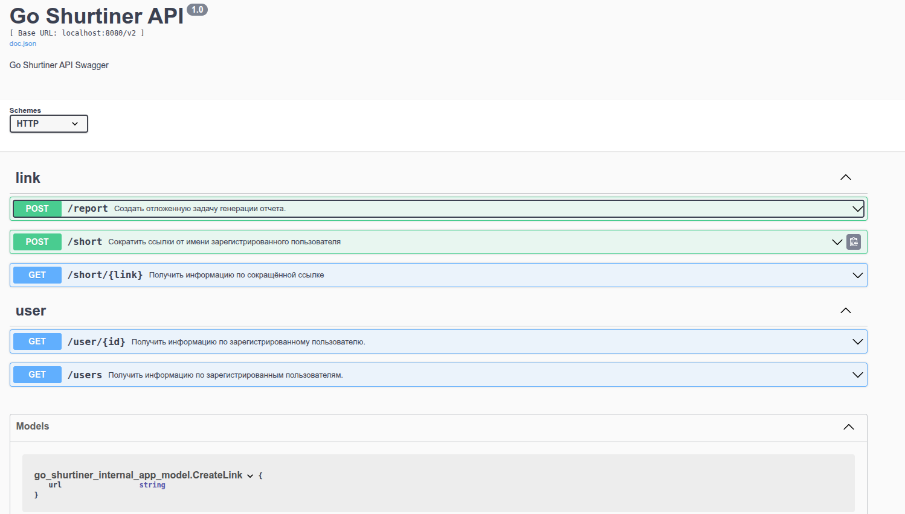

# Проект [go_shortiner](https://github.com/akozadaev/go_shortiner) 
предназначен для демонстрации некоторых возможностей языка Go

## Показывает работу с БД и ORM

PostgreSQL + GORM, подумать над миграциями (авто)
## Показывает работу с фреймворками, зависимостями

Gin Web Framework, Fx

##  Журналирование, ротация логов, трассировка

Zap, Jaeger


## Показывает работу с паттерном проектирования  Medaitor

Метод с общим названием Generate

## Для запуска

скачать репозиторий, создать пeстую базу Postgres ```link```, выполнить в консоли ```make build```, запустить собранное приложение.

### Роуты:
1. 
[POST] /v1/short

с телом объект или массив объектов вида:
```JSON
[
  {
    "url": "http://longlonglonglonglonglonglonglongurl.url"
  },
  {
    "url": "http://longlonglonglonglonglonglonglonglonglonglonglonglongurl.url"
  }
]
```
или
```JSON
{
  "url": "http://longlonglonglonglonglonglonglonglonglonglonglonglongurl.url"
}
```

2. 
[GET] /v1/short/:shortened

ответ вида:
```JSON
{
    "ID": 4,
    "CreatedAt": "2025-01-20T00:34:48.852775+03:00",
    "UpdatedAt": "2025-01-20T00:34:48.852775+03:00",
    "DeletedAt": null,
    "source": "http://urlEEEEEEEEee.url",
    "shortened": "https://short.ru/4339487037079594733"
}
```

Как может выглядеть вставка в таблицу для подготовки отчетов
```
INSERT INTO PREPARED_report (id, created_at, updated_at, timestamp, source, shortened, user_email, user_fullname)  
VALUES (1, '2025-03-15T12:00:00Z', now(), '2025-03-15T12:00:00Z', 'https://example.com', 'exmpl', 'user@example.com', 'John Doe');
```

Функция для ручного создания партиций при тестировании:
```SQL
CREATE OR REPLACE FUNCTION create_prepared_report_partition_for_date(p_created_at TIMESTAMPTZ)
RETURNS void AS $$
DECLARE
    partition_name TEXT;
    start_date TIMESTAMPTZ;
    end_date TIMESTAMPTZ;
BEGIN
    start_date := date_trunc('month', p_created_at);
    end_date := start_date + INTERVAL '1 month';
    partition_name := 'prepared_report_' || to_char(start_date, 'YYYY_MM');

    -- Проверяем, существует ли партиция
    IF NOT EXISTS (
        SELECT 1 FROM pg_class c
        JOIN pg_namespace n ON n.oid = c.relnamespace
        WHERE c.relname = partition_name AND n.nspname = 'public'
    ) THEN
        EXECUTE format(
            'CREATE TABLE %I PARTITION OF prepared_report
             FOR VALUES FROM (%L) TO (%L);',
            partition_name, start_date, end_date
        );
    END IF;
END;
$$ LANGUAGE plpgsql;
```

Вызов этой функции:
```SQL
SELECT create_prepared_report_partition_for_date('2025-05-15 00:00:00+03');
```